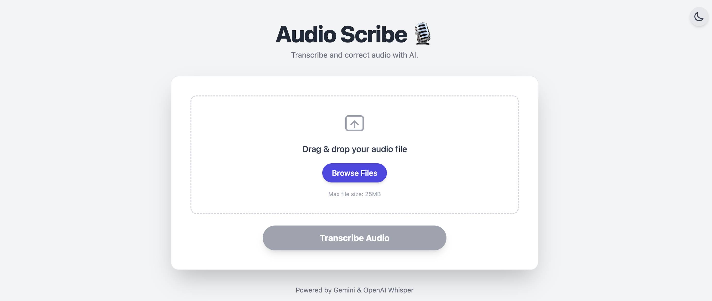
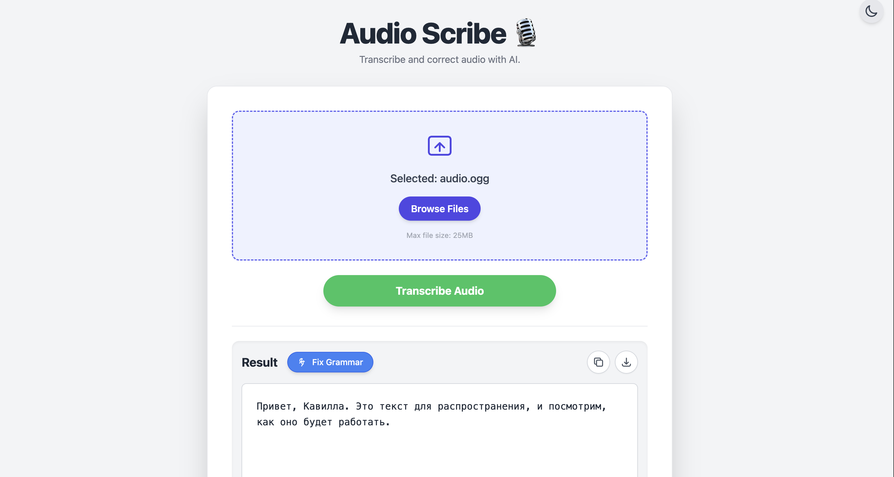
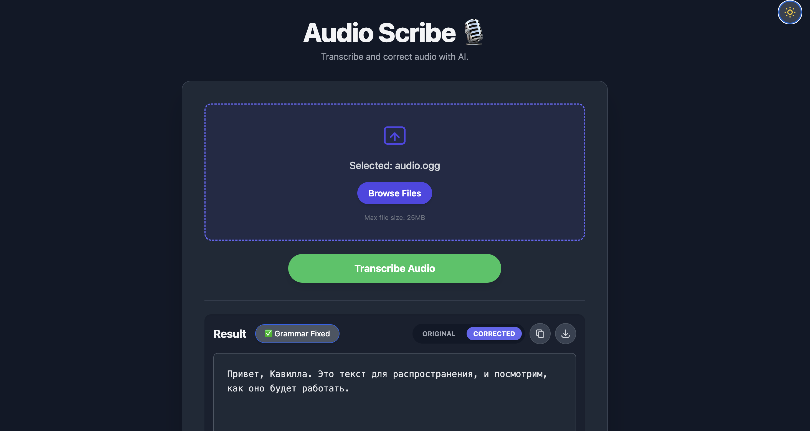
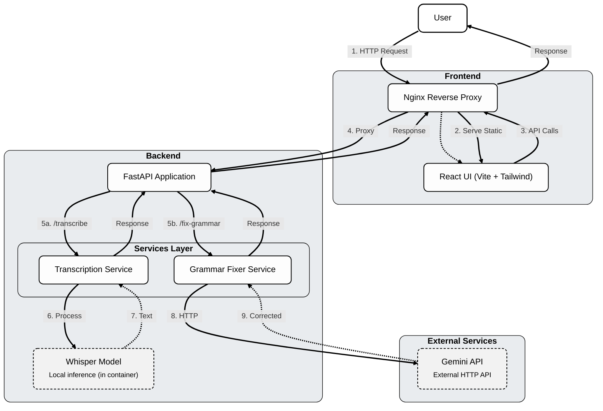

# 🎙️ Audio Scribe

> A full-stack web application that transcribes audio files and corrects the grammar of the resulting text using AI.

[](https://opensource.org/licenses/MIT)

---
## Audio Scribe demo screens

### Home Page


### Transcription Flow


### Grammar Correction

---

## Tech Stack

- **Frontend:** React, Vite, Tailwind CSS
- **Backend:** FastAPI (Python)
- **AI:**
  - **Transcription:** `openai-whisper` (local model)
  - **Grammar Correction:** Google Gemini API
- **Infrastructure:** Docker, Docker Compose, Nginx

---

## Features

- **Seamless Audio Upload:** Drag-and-drop or browse for audio files (MP3, WAV, M4A, etc.).
- **Accurate Transcription:** Utilizes OpenAI's Whisper model for fast and accurate speech-to-text conversion.
- **AI-Powered Grammar Correction:** One-click grammar and fluency correction using the Gemini API.
- **Dark Mode:** Sleek, user-friendly interface with a dark mode toggle.
- **Containerized:** Fully containerized with Docker for consistent, cross-platform deployment.
- **Automated CI Pipeline:** GitHub Actions for automated testing, linting, and build verification.

---

## Architecture

The application is composed of two main services orchestrated by Docker Compose: a frontend container and a backend container.



---

## CI Status

[](https://github.com/romanvlad95/audio-scribe/actions/workflows/ci.yml)

---


## Getting Started

### Prerequisites

- [Docker & Docker Compose](https://www.docker.com/products/docker-desktop)
- A **Google Gemini API Key** — used for grammar correction. You can get one from [Google AI Studio](https://aistudio.google.com/app/apikey).
- An **OpenAI API Key** — (optional but not necessary) if you want to use OpenAI Whisper API for transcription.
### ⚙️ Installation

1.  **Clone the repository:**
    > **Note:** Remember to replace `your-username/your-repo` with your actual repository details.
    ```bash
    git clone https://github.com/romanvlad95/audio-scribe
    cd audio-scribe
    ```

2.  **Create the environment file:**
    Create a file named `.env` in the project root and add your Gemini API key. The transcription uses a local model and does not require a key.
    ```text
    # .env
    GEMINI_API_KEY="your-gemini-api-key"
    ```

3.  **Build and run with Docker Compose:**
    ```bash
    docker-compose up --build
    ```
    The application will become available at `http://localhost:3000`.

---

## Usage

1.  Open your web browser and navigate to `http://localhost:3000`.
2.  Drag and drop an audio file or use the "Browse Files" button to select one.
3.  Click "Transcribe Audio".
4.  Once transcription is complete, you can click "Fix Grammar" to get a corrected version of the text.

---

## License

This project is licensed under the MIT License.
